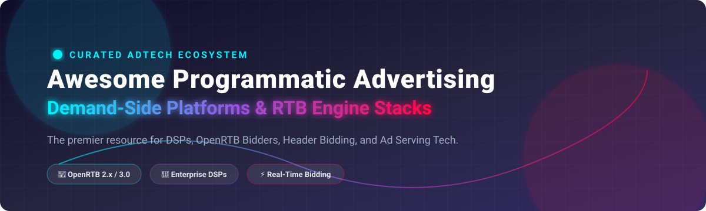

# 📢 Awesome-Programmatic-Advertising-Platform

     

## 🎯 Top Programmatic Advertising Platforms Ecosystem

**Curated List of Enterprise SaaS DSPs & Open-Source GitHub AdTech Infrastructure** 🚀

*Focused on Demand-Side Platforms (DSPs), Real-Time Bidding (RTB) Bidders, OpenRTB 2.5/3.0 Protocols, Header Bidding, Ad Servers, & Omnichannel Media Activation* 📊

📅 **Last updated: September 2026**

---

### 🌐 Overview & SEO Keywords

This repository provides an authoritative guide to **Programmatic Advertising Platforms**, **Demand-Side Platforms (DSPs)**, and **Open-Source Real-Time Bidding (RTB) Engines**. Designed for media buyers, ad-tech software engineers, product managers, and growth teams, this index covers both commercial SaaS advertising platforms (The Trade Desk, Google DV360, Amazon DSP) and high-performance open-source bidding frameworks (Prebid, Revive, RTBkit).

**Primary Topics & Search Keywords:** `programmatic-advertising`, `demand-side-platform`, `dsp`, `real-time-bidding`, `openrtb`, `adtech`, `header-bidding`, `ad-server`, `prebid`, `omnichannel-buying`.

---

## 📋 Table of Contents

- [🌐 Overview & SEO Keywords](#-overview--seo-keywords)
- [☁️ SaaS & Enterprise DSP Platforms](#️-saas--enterprise-dsp-platforms)
- [💻 Open-Source GitHub Projects](#-open-source-github-projects)
- [🧠 Programmatic AdTech Concepts & Terminology](#-programmatic-adtech-concepts--terminology)
- [🤝 How to Contribute](#-how-to-contribute)
- [⚠️ Disclaimer](#%EF%B8%8F-disclaimer)
- [🌟 Star History](#-star-history)

---

## ☁️ SaaS & Enterprise DSP Platforms

📊 **Market Overview**: The global Programmatic Advertising market is estimated at **$550 Billion – $600 Billion** (projected to exceed $1 Trillion by 2030). The Demand-Side Platform (DSP) sector is **highly consolidated**, dominated by top cloud & media giants (Microsoft, Google, Amazon) and category leader The Trade Desk, while specialized platforms compete in niche verticals.

| Platform | Description | Pricing (Specific Starting Tier) | Free Tier / Trial Details | Company Size (Valuation / Revenue) |
| :--- | :--- | :--- | :--- | :--- |
| 🔹 **[Xandr / Microsoft Invest](https://www.xandr.com/)** | Microsoft’s demand-side platform (formerly Xandr) offering premium inventory and Microsoft first-party data advantages. | ~10%–15% platform tech fee on ad spend; minimum monthly spend commitment starting at $10,000/mo. | No free tier or trial; requires enterprise contract signup and sales rep approval. | Market Cap ~$3.1 Trillion / Annual Revenue ~$245 Billion |
| 🔹 **[Google Display & Video 360 (DV360)](https://marketingplatform.google.com/about/display-video-360/)** | Google’s enterprise DSP tightly integrated with YouTube, Google inventory, and the broader Google Marketing Platform. | ~12%–15% tech fee on ad spend; minimum contract spend commitment of $10,000 to $50,000/mo. | No free tier or free trial; access requires a Google Marketing Platform enterprise agreement or partner reseller seat. | Market Cap ~$2.1 Trillion / Annual Revenue ~$307 Billion |
| 🔹 **[Amazon DSP](https://advertising.amazon.com/solutions/products/amazon-dsp)** | Amazon’s demand-side platform leveraging first-party shopping and browsing data for commerce-oriented advertising. | ~$35,000 minimum spend commitment for managed service; ~15% tech fee + media spend for self-serve via agency. | No free tier or public free trial; account creation requires Amazon Ads representative onboarding. | Market Cap ~$1.9 Trillion / Annual Revenue ~$575 Billion (Ad Revenue ~$47B) |
| 🔹 **[The Trade Desk](https://www.thetradedesk.com/)** | Leading independent demand-side platform known for broad inventory access, strong CTV capabilities, and identity solutions such as UID2. | ~15%–20% platform take-rate on media spend; direct platform minimum spend commitment of $100,000/mo. | No free tier or trial; requires formal sales contract and enterprise minimum spend guarantee. | Market Cap ~$45 Billion / Annual Revenue ~$1.95 Billion |
| 🔹 **[Yahoo DSP](https://www.yahooinc.com/advertising/)** | Yahoo’s demand-side platform providing access to Yahoo inventory and broader programmatic channels. | Custom spend tech fees starting with minimum ad spend commitment of $5,000 to $10,000/mo. | No free tier or self-serve trial; live sales demo & customized onboarding evaluation available. | Valuation ~$5 Billion+ / Annual Revenue ~$7 Billion |
| 🔹 **[StackAdapt](https://www.stackadapt.com/)** | Mid-market, self-serve programmatic platform supporting multi-channel campaigns including CTV and native. | $0 recurring platform fee; pay-per-campaign media cost with minimum initial campaign deposit of $500. | No free trial ad credit; free platform registration with interactive demo access and $500 min deposit per campaign. | Valuation ~$1 Billion+ / Est. Annual Revenue ~$150M+ |
| 🔹 **[Basis Technologies](https://basis.com/)** | Agency-oriented platform combining programmatic buying with planning and workflow tools. | Platform SaaS license starting at $1,000/mo plus ~10%–15% fee on media spend. | No free tier; offers 1-on-1 live product demo & guided trial upon sales request. | Valuation ~$500 Million / Est. Annual Revenue ~$150 Million |
| 🔹 **[Adform](https://www.adform.com/)** | Independent advertising technology platform offering DSP and related programmatic capabilities with a focus on transparency. | Tech fee starting at ~10%–15% of gross ad spend with minimum monthly commitment of $2,500/mo. | No free tier or free trial; enterprise sandbox testing environment available upon request. | Valuation ~$300M–$500M / Est. Annual Revenue ~$100 Million |
| 🔹 **[Smadex](https://www.smadex.com/)** | Programmatic platform specializing in mobile and app-based advertising. | Performance-based rates (CPM/CPI/CPA) starting at minimum campaign spend of $2,000/mo. | No free tier; guided demo and test account access upon verification of app campaign budget. | Parent Market Cap ~$300M / Parent Revenue ~$1.1 Billion (Smadex Div. ~$50M) |
| 🔹 **[MediaMath](https://www.mediamath.com/)** | Programmatic platform historically focused on omnichannel buying and data-driven activation. | ~10%–18% platform take-rate on ad spend with minimum monthly spend commitment starting at $5,000/mo. | No free tier or trial; custom onboarding via Infillion sales representative. | Acquired for ~$22 Million (Infillion) / Est. Revenue ~$20M–$40M |

---

## 💻 Open-Source GitHub Projects

*Sorted by GitHub Star Count (Descending)* 🌟

- 🔹 **[Prebid.js](https://github.com/prebid/Prebid.js)**   
  Industry-standard open-source header bidding client framework allowing publishers to monetize web inventory with demand partners simultaneously.

- 🔹 **[Revive Adserver](https://github.com/revive-adserver/revive-adserver)**   
  Popular open-source ad serving system enabling publishers to serve ads, track impressions and CTRs, and manage direct campaign delivery.

- 🔹 **[RTBkit](https://github.com/rtbkit/rtbkit)**   
  Modular C++ real-time bidding framework designed to build custom bidders, DSPs, and bid engines for display, mobile, and video ad auctions.

- 🔹 **[Prebid Server](https://github.com/prebid/prebid-server)**   
  High-performance server-side header bidding engine (Go & Java) designed to reduce page latency for mobile apps, CTV, and web auctions.

- 🔹 **[Google OpenRTB](https://github.com/google/openrtb)**   
  Google's Java library and JSON/Protobuf serialization utilities for processing OpenRTB bid request and response structures.

- 🔹 **[IAB OpenRTB Spec](https://github.com/InteractiveAdvertisingBureau/openrtb)**   
  Official IAB Tech Lab OpenRTB specification repository containing schemas, definitions, and protocol standards for real-time bidding.

- 🔹 **[Vanilla RTB](https://github.com/vanilla-rtb/vanilla-rtb)**   
  High-performance C++11/14 RTB engine and developer framework for building scalable custom demand-side bidding engines.

- 🔹 **[bsm/openrtb](https://github.com/bsm/openrtb)**   
  Fast, lightweight Go implementation of the OpenRTB 2.x protocol for bid request and response parsing.

- 🔹 **[RTB4FREE Bidder](https://github.com/RTB4FREE/bidder)**   
  Java 1.8+ OpenRTB bidder engine designed for high throughput (25k+ QPS per node) and custom campaign target matching.

- 🔹 **[Awesome-RTB](https://github.com/vanilla-rtb/awesome-rtb)**   
  Curated collection of open-source RTB frameworks, bidder components, protocol implementations, and ad-tech learning resources.

---

## 🧠 Programmatic AdTech Concepts & Terminology

- 🎯 **Demand-Side Platform (DSP)**: Software that allows advertisers and media buyers to buy display, video, mobile, and CTV ad inventory automatically.
- ⚡ **Real-Time Bidding (RTB)**: The algorithmic auction process by which ad impressions are bought and sold in milliseconds.
- 📡 **OpenRTB Protocol**: The standardized communication protocol maintained by the IAB Tech Lab for bid requests and bid responses.
- ⏱️ **Header Bidding**: An advanced programmatic technique where publishers offer inventory to multiple ad exchanges simultaneously before calling their primary ad server.
- 🏷️ **Bid Shading**: An algorithm used in first-price auctions to calculate the optimal bid price below the buyer's maximum willingness to pay.

---

## 🤝 How to Contribute

1. 🍴 Fork the repo.
2. 📝 Add/edit entries in `README.md` (follow existing format).
3. ℹ️ Include: name, link, 1–2 sentence description, and whether it's SaaS or open-source.
4. 📬 Submit PR with a short explanation.

⭐ **Star the repo if you find it useful!**

---

## ⚠️ Disclaimer

- 📌 This is a **community-curated** list — not exhaustive and not an endorsement.
- ⚖️ Programmatic advertising involves significant spend, data privacy (GDPR, CCPA, etc.), brand safety, and fraud risks. Open-source RTB components require deep expertise in ad tech, security, and compliance. Errors can result in wasted budget or regulatory issues. This list is not advertising, legal, or financial advice.

---

## 🌟 Star History

---

🌟 **Made for media buyers, ad-tech engineers, and agencies who want transparent and efficient programmatic activation.**

Let's keep programmatic advertising competitive, measurable, and as open as practical. 🎉
